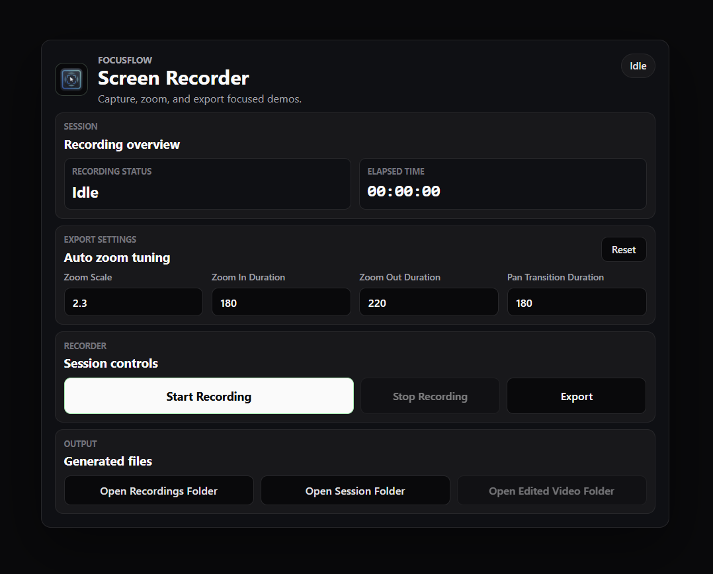
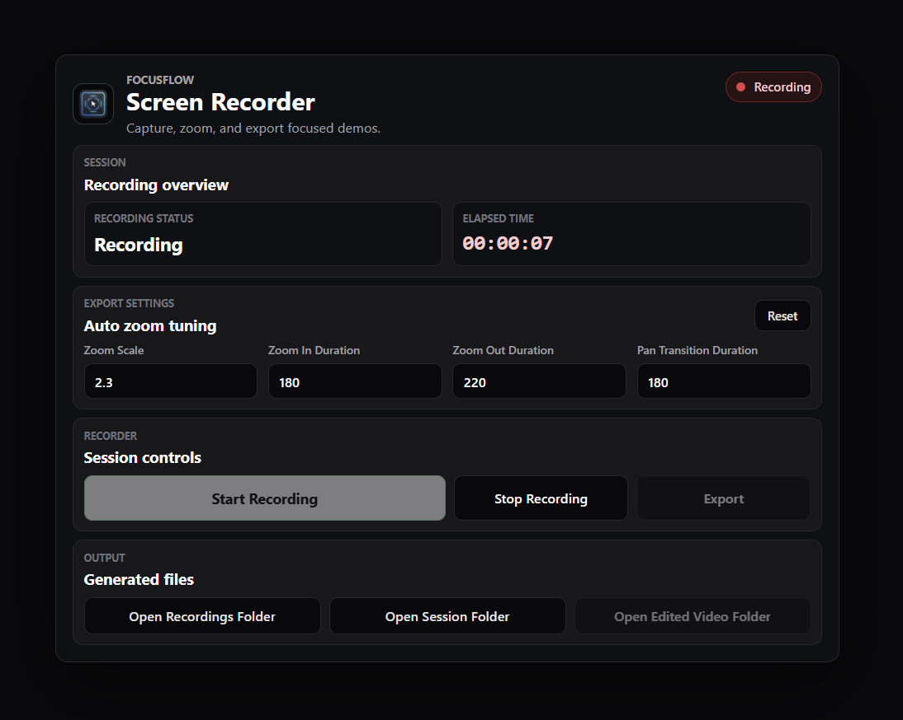
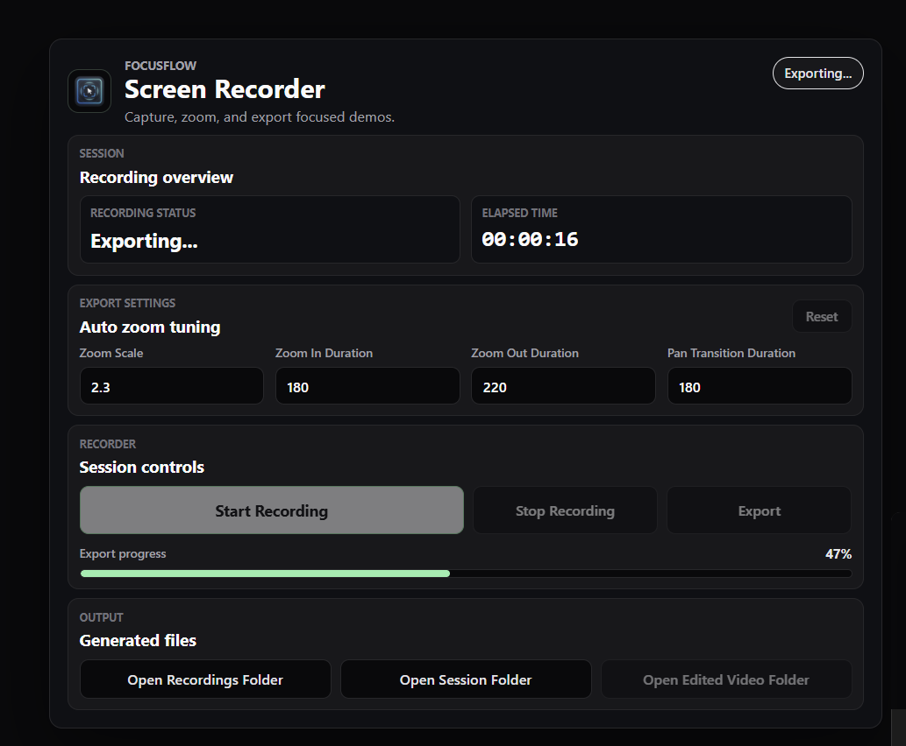
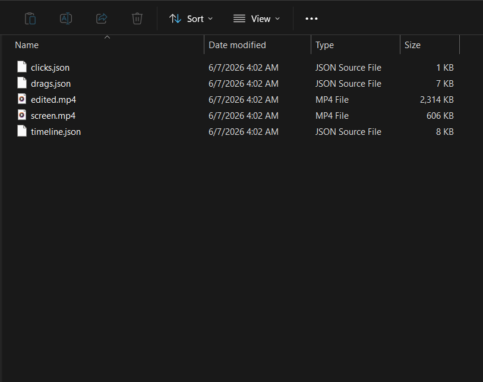
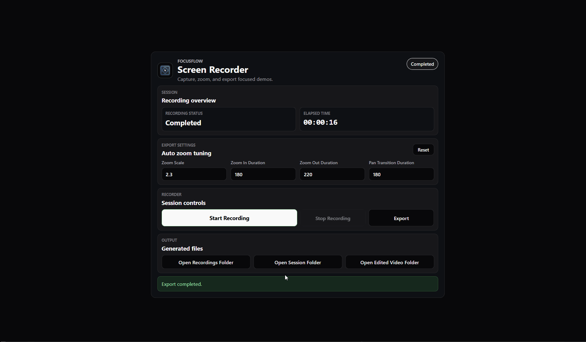
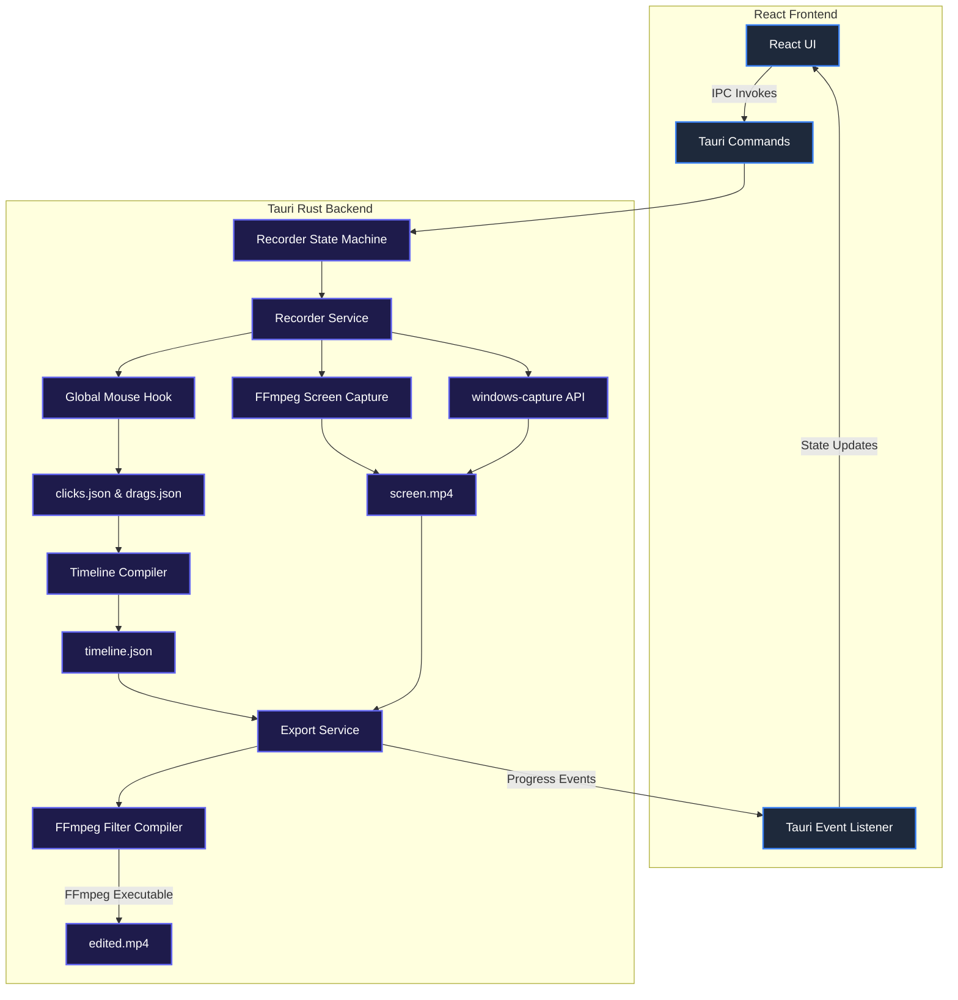

# FocusFlow

### Screen recording that edits itself

[](https://github.com/UmarAlMukhtar/FocusFlow/releases)
[](LICENSE)
[](https://github.com/UmarAlMukhtar/FocusFlow)

FocusFlow is an open-source Windows desktop application that automatically transforms raw screen recordings into polished, professional tutorial and demo videos. By tracking user interactions (clicks and drags) and applying intelligent, smooth camera movements, FocusFlow edits your videos automatically.

🌐 **Website:** [focusflow.demosnap.tech](https://focusflow.demosnap.tech/)  
📦 **Downloads & Releases:** [GitHub Releases](https://github.com/UmarAlMukhtar/FocusFlow/releases)

---

## Overview

Creating high-quality tutorials, product demos, or documentation videos usually requires hours of tedious post-production: trimming, panning, zooming in on clicks, and inserting cursor highlights. FocusFlow automates this entire pipeline.

As you record your screen, window, or a custom region, FocusFlow runs a lightweight hook in the background to capture your cursor coordinates, clicks, and drag events. When you stop recording, it compiles these interactions into a clean editing timeline. During the export process, FocusFlow uses a highly optimized FFmpeg pipeline to apply smooth, organic zoom-ins, natural pans, and clear click ripple indicators, producing a finished product that looks like it was edited by a pro.

---

## Problem Statement

Producing polished software walkthroughs is a major bottleneck for creators, developers, and founders. After recording raw screen captures, they must manually:

* Cut out long pauses or transition times.
* Manually zoom in on small buttons and key input fields so viewers can follow along.
* Hand-animate camera pans to follow the cursor.
* Superimpose click indicators or cursor highlights to make interactions obvious.

Existing automated solutions are typically:
* Expensive, subscription-based closed-source products.
* Tied to proprietary cloud platforms.
* Inflexible or bloated with unnecessary features.
* Unsupported on local machines without an internet connection.

---

## Solution

FocusFlow provides a local, lightweight, and completely free open-source solution that runs entirely on your machine.

1. **Record**: Capture your desktop screen, a specific application window, or a selected region.
2. **Track**: Capture mouse clicks, coordinates, and drags silently in the background.
3. **Analyze**: Automatically resolve and structure the interaction data into a non-overlapping timeline.
4. **Render**: Apply mathematical easing (cosine curves) for smooth camera pans and zooms, and draw visual click ripples.
5. **Export**: Produce a high-quality, production-ready MP4 video in seconds.

---

## Features

* **Multiple Recording Modes**: Capture the full screen, a custom-drawn region, or a selected application window.
* **Smart Click & Drag Tracking**: Log click coordinates, timestamps, and drag paths.
* **Window-Scoped Click Filtering**: Clicks outside the active recording window are automatically ignored when in Window Recording mode.
* **Window-Relative Tracking**: Stores clicks relative to the target window so that alignment remains perfect even if the window is moved.
* **Automatic Easing & Zoom**: Generates smooth zoom and pan keyframes using ease-in-out (cosine) interpolation.
* **Visual Click Ripple Indicators**: Automatically overlays clean ripple indicators at click positions.
* **Intelligent Timeline Optimization**: Merges nearby clicks and drag segments (within 300ms) to ensure continuous, natural camera flow.
* **Bundled FFmpeg Sidecar**: No external dependencies or complicated command-line setups required.
* **Windows File Explorer Integration**: Quick links to open your recordings and exports directories directly.
* **Modern dark UI**: Clean, native-feeling desktop experience built with React and Tailwind CSS.
* **Global Hotkeys**: Control recordings instantly using keyboard shortcuts:
  * `Ctrl + Shift + R`: Start Recording
  * `Ctrl + Shift + S`: Stop Recording

---

## Screenshots

### Main Dashboard


### Active Recording State


### Export & Render Progress


### Rendered Output Sample


---

## Demo

* **Pitch Deck:** [View FocusFlow Slide Deck](https://gamma.app/docs/Turn-Raw-Recordings-Into-Polished-Tutorials-Automatically-qjdjzxy1zv4jb4f)
* **Demo Video:** [Watch on YouTube](https://youtu.be/NfqgOWDMl8A)
* **Interactive Demo:** Check out the interactive gif below showing the auto-zoom output:



---

## Installation

FocusFlow is distributed as a native Windows application.

1. Head over to the [GitHub Releases Page](https://github.com/UmarAlMukhtar/FocusFlow/releases).
2. Download the latest `.msi` installer for your system (e.g., `FocusFlow_0.1.1_x64_en-US.msi`).
3. Run the installer and follow the on-screen instructions.
4. Launch FocusFlow from your Start Menu.

> [!NOTE]
> FocusFlow bundles the required FFmpeg binary as a Tauri sidecar. No separate installation of FFmpeg is required.

---

## Usage

1. **Select Recording Mode**:
   * **Screen**: Records your entire primary monitor.
   * **Region**: Allows you to draw a custom bounding box on your screen.
   * **Window**: Lets you select a specific open application window to capture.
2. **Start Recording**: Click the "Record" button or press `Ctrl + Shift + R`. A 3-second countdown will initiate before recording begins.
3. **Perform Actions**: Click, drag, and navigate through your workflow as normal. 
   * *If recording a window, dragging or moving the window is supported; clicks will automatically map to the window's coordinates.*
4. **Stop Recording**: Click the "Stop" button in the overlay or press `Ctrl + Shift + S`.
5. **Review and Export**: FocusFlow will list your recorded session. Click "Export" to compile the timeline, apply zoom/pan easing, render click indicators, and save the final `edited.mp4` video.

---

## Tech Stack

* **Frontend Framework**: React, TypeScript, Tailwind CSS, Vite
* **Backend Core**: Rust, Tauri v2
* **Recording Engines**:
  * Screen and Region Recording: FFmpeg Sidecar
  * Window Recording: Native Windows Graphics Capture API via `windows-capture`
* **Interaction Hooks**: Windows API (via Rust `user32` crate) for global mouse hook and window-level target resolution.
* **Export & Processing Engine**: FFmpeg Sidecar (custom `filter_complex` script generation).

---

## Architecture Overview

FocusFlow utilizes a decoupled frontend/backend architecture where the React frontend drives the user experience and Tauri (Rust) orchestrates low-level capture, file processing, and command line tools.



---

## Recording Modes

FocusFlow supports three specialized recording backends depending on your focus:

1. **Screen Recording**: Captures the full primary monitor. Best for desktop-wide workflows and multi-app walkthroughs.
2. **Region Recording**: Records a specified desktop rectangle. Ideal for cropping out sensitive UI details or system toolbars.
3. **Window Recording**: Uses the high-performance Windows Graphics Capture API (`windows-capture`). Only records the target application window.
   * Clicks outside the window boundary are automatically ignored.
   * Mouse coordinates are normalized to the window coordinate space, keeping clicks perfectly aligned even if the target window is moved.

---

## Export Pipeline Explanation

When an export is triggered, FocusFlow runs a highly optimized multi-stage processing pipeline:

```text
[screen.mp4] + [timeline.json]
       │
       ▼
1. Keyframe Compiler ───────► Interpolates camera positions using ease-in-out cosine curves.
       │                      Computes zoom levels (default 2.3x) and target x/y offsets.
       ▼
2. FFmpeg Filter Generator ─► Compiles a custom filter script containing:
       │                      • trim & setpts filters (segments)
       │                      • zoompan filters (d=1, avoiding frame multiplication)
       │                      • drawbox/drawgrid overlay filters (click indicators)
       ▼
3. Sidecar Execution ───────► Spawns the FFmpeg sidecar with the filter script.
       │                      Monitors stdout/stderr to stream progress back to Tauri.
       ▼
[edited.mp4] ───────────────► Final output video is written atomically.
```

---

## Known Limitations

* **Window Resizing**: Resizing a window during recording is not fully supported. If a window is expanded during capture, newly exposed regions may appear black.
* **Audio Capture**: FocusFlow does not record microphone or system audio in version v0.1.1. Audio tracks must be added post-export.
* **Manual Timeline Editing**: The timeline is fully automated based on click timings. A manual editor interface is planned for a future release.
* **Windows-First**: The application relies heavily on native Windows capture libraries (`windows-capture`) and Windows user32 APIs for global mouse hooks. macOS and Linux support are currently not available.

---

## Roadmap

See the detailed [ROADMAP.md](docs/ROADMAP.md) for full release plans.

* **v0.2.0**: Microphone recording and audio device selection.
* **v0.3.0**: System audio recording and multi-track audio mixing.
* **v0.4.0**: Interactive timeline editor UI.
* **v0.5.0**: Custom cursor styles, text annotations, and export quality presets.
* **Future**: Cross-platform support (macOS/Linux), AI-assisted video editing, and direct cloud sharing.

---

## Contributing

We welcome contributions of all levels! Please read our [CONTRIBUTING.md](CONTRIBUTING.md) to learn how to:
* Set up your local development environment.
* Work with the Rust backend and React frontend.
* Write clean commits and verify your changes.
* Open bug reports and feature requests.

---

## License

FocusFlow is released under the [MIT License](LICENSE).
