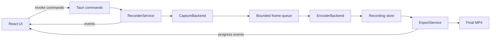
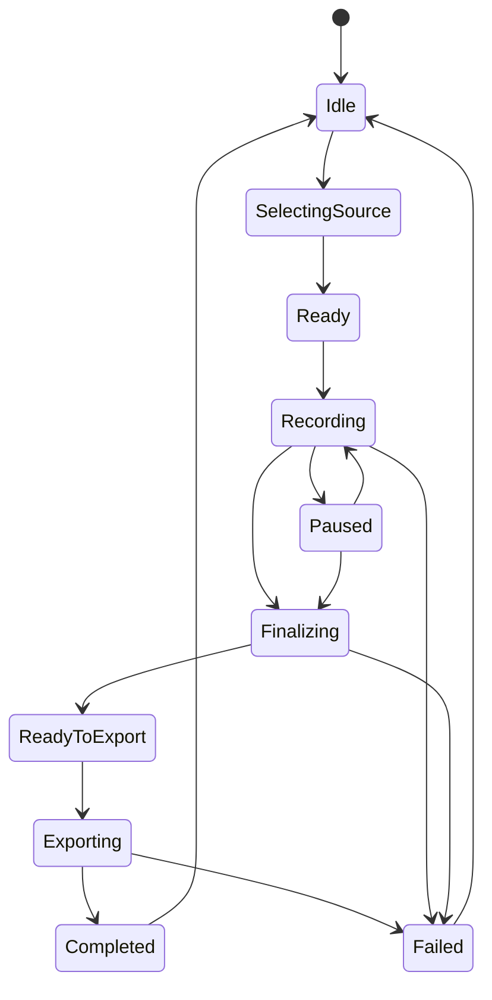

# Tauri + React Screen Recorder Architecture

## Scope

Build a desktop Tauri + React screen recorder that can:

- Record screen video.
- Export a finished recording as MP4.

The MVP is video-only. Microphone and system audio should be designed as future tracks, not implemented in the first architecture slice.

## Architectural Position

React owns the user experience. Rust owns capture, encoding, file writes, permissions, process lifecycle, and export integrity.

The frontend must not receive raw frame streams over Tauri IPC. IPC is for commands, state changes, progress, and low-frequency preview metadata only. High-volume frame movement stays inside the Rust/native capture and encoder pipeline.

## High-Level Diagram



## Project Layout

```text
src/
  app/
    App.tsx
    routes.tsx
  features/recorder/
    RecorderScreen.tsx
    recorderStore.ts
    recorderCommands.ts
    components/
      SourcePicker.tsx
      TransportControls.tsx
      RecordingStatus.tsx
      ExportPanel.tsx
  shared/
    tauriEvents.ts
    types.ts

src-tauri/
  capabilities/
    recorder.json
  binaries/
    ffmpeg-<target-triple>
  src/
    main.rs
    commands.rs
    recorder/
      mod.rs
      ids.rs
      models.rs
      service.rs
      state_machine.rs
      events.rs
      capture/
        mod.rs
        windows.rs
        macos.rs
        linux.rs
        synthetic.rs
      encoder/
        mod.rs
        ffmpeg_sidecar.rs
        native.rs
      export/
        mod.rs
        mp4.rs
      storage/
        mod.rs
        recording_store.rs
      permissions/
        mod.rs
```

## Runtime Components

### React Frontend

Responsibilities:

- Display capture source picker, recording controls, timer, status, and export progress.
- Call Rust commands through Tauri IPC.
- Subscribe to recorder and export events.
- Keep UI state derived from backend state, not independently authoritative.

Recommended state shape:

```text
idle
selecting_source
ready
recording
paused
finalizing
exporting
completed
failed
```

### Tauri Command Layer

Commands are small request/response entry points. They validate input, call `RecorderService`, and return serializable DTOs.

Commands:

```text
list_capture_sources() -> Vec<CaptureSource>
get_permission_status() -> PermissionStatus
request_capture_permission() -> PermissionStatus
start_recording(config: RecordingConfig) -> RecordingId
pause_recording(id: RecordingId) -> RecordingStatus
resume_recording(id: RecordingId) -> RecordingStatus
stop_recording(id: RecordingId) -> RecordingSummary
export_mp4(id: RecordingId, options: ExportOptions) -> ExportJobId
cancel_export(job_id: ExportJobId) -> ExportStatus
show_export_in_folder(path: String) -> Result
```

Events:

```text
recorder:status
recorder:stats
recorder:error
export:progress
export:completed
export:error
```

### RecorderService

`RecorderService` is the backend coordinator stored in Tauri managed state.

Responsibilities:

- Enforce the recording state machine.
- Own active recording sessions.
- Start and stop native capture adapters.
- Start and stop encoder tasks.
- Emit debounced UI events.
- Ensure recordings are finalized before export.
- Clean up temp files on cancellation or failure.

Concurrency model:

- One async task for capture lifecycle.
- One blocking or async task for encoding.
- Bounded frame channel between capture and encoder.
- Event emission throttled to avoid flooding the WebView.
- A cancellation token per recording and export job.

## Capture Backend

Define a platform abstraction:

```text
CaptureBackend
  list_sources() -> Vec<CaptureSource>
  permission_status() -> PermissionStatus
  request_permission() -> PermissionStatus
  start(source, config, frame_tx, control_rx) -> CaptureSession
```

`CaptureFrame` should include:

```text
recording_id
width
height
pixel_format
stride
timestamp_monotonic
cursor_state
damage_region optional
buffer
```

Platform adapters:

- Windows: use Windows Graphics Capture through the Rust `windows` bindings. Prefer GPU texture flow where possible, CPU copy fallback for the FFmpeg sidecar.
- macOS: use ScreenCaptureKit through Rust bindings or a small Objective-C/Swift bridge. Handle macOS screen recording permission explicitly.
- Linux: use XDG Desktop Portal ScreenCast with PipeWire for Wayland-first support. X11 fallback can be a later adapter if needed.
- Synthetic: generate deterministic frames for tests and export pipeline validation.

Cursor handling:

- Prefer native embedded cursor if the OS backend supports it.
- Otherwise composite cursor in the frame normalizer before encoding.

## Encoding Architecture

Define an encoder abstraction:

```text
EncoderBackend
  start(recording_id, video_params, output_target) -> EncoderSession
  push_frame(frame) -> Result
  finish() -> EncodedArtifact
  cancel() -> Result
```

MVP encoder:

- Use bundled FFmpeg as a Tauri sidecar.
- Feed normalized raw frames to FFmpeg stdin.
- Encode H.264-compatible video.
- Write to an intermediate recording artifact.

Why sidecar first:

- Keeps native codec integration out of the first release.
- Makes export behavior observable through process stderr/progress.
- Allows later replacement with native encoders without changing UI or service contracts.

Important licensing decision:

- Do not casually ship a GPL FFmpeg/libx264 build in a commercial app.
- Decide upfront whether the app ships an LGPL FFmpeg build using platform encoders, accepts GPL obligations, or uses native OS encoders directly.

## Storage Model

Each recording gets an isolated working directory:

```text
app_data/
  recordings/
    <recording_id>/
      manifest.json
      capture.tmp.mkv
      capture.log
      thumbnail.jpg
  exports/
    <recording_id>.mp4
```

Manifest fields:

```text
recording_id
source
created_at
duration_ms
width
height
fps_target
fps_actual
frame_count
dropped_frames
intermediate_path
status
```

Use atomic rename for finalized files:

```text
export.tmp.mp4 -> export.mp4
```

## MP4 Export

Export is a separate job from recording finalization.

Recommended flow:

1. Recording writes an intermediate artifact, preferably Matroska or fragmented media to reduce corruption risk if the process exits mid-recording.
2. `stop_recording` finalizes the encoder and marks the manifest as ready.
3. `export_mp4` remuxes compatible H.264 video into MP4 when possible.
4. If export options require resize, fps conversion, or codec change, transcode instead of remux.
5. On success, atomically move the temp MP4 to the requested export path.

Default export options:

```text
container: mp4
video_codec: h264
pixel_format: yuv420p
fast_start: true
preserve_resolution: true
preserve_fps: true
```

## State Machine



Rules:

- Only one active recording session in MVP.
- Export can run only for finalized recordings.
- Stop always attempts encoder finalization before returning failure.
- Cancellation leaves either a recoverable intermediate artifact or deletes the working directory.

## Backpressure and Timing

Screen capture can produce frames faster than encoding can consume them. The pipeline needs explicit backpressure behavior.

Policy:

- Use a small bounded frame queue.
- Never block the native capture callback for long-running encoding work.
- Drop oldest unencoded frames when the queue is full.
- Preserve monotonic timestamps so the exported video duration remains accurate.
- Emit dropped frame counts through `recorder:stats`.

## Security and Permissions

Tauri capability design:

- Allow only recorder-related commands for the main window.
- Allow event APIs needed for recorder and export progress.
- If FFmpeg is used as a sidecar, whitelist the sidecar name and allowed argument shapes.
- Never expose arbitrary shell execution to React.

Path handling:

- User-selected export paths must be canonicalized.
- Temporary recording files stay inside app data.
- Reject path traversal and unsupported extensions.
- Final export path must end in `.mp4`.

Privacy:

- Surface OS permission failures clearly.
- Do not persist captured frames outside the recording working directory.
- Delete temp artifacts on explicit discard.

## React Screen Structure

The first screen is the recorder itself, not a landing page.

Layout:

```text
RecorderScreen
  SourcePicker
  PreviewSurface
  TransportControls
  RecordingStatus
  ExportPanel
```

Preview policy:

- Do not stream full-resolution frames through IPC.
- If preview is required, publish low-frequency preview snapshots or use a native-preview strategy per platform.
- Recording must work even when preview is disabled.

## Error Model

Backend errors should be typed:

```text
PermissionDenied
SourceUnavailable
CaptureUnsupported
EncoderUnavailable
EncoderCrashed
ExportFailed
InvalidState
InvalidPath
IoError
```

Each error returned to React includes:

```text
code
message
recording_id optional
job_id optional
recoverable
```

## Testing Strategy

Unit tests:

- State machine transitions.
- Export path validation.
- Manifest read/write.
- Command input validation.

Integration tests:

- Synthetic capture backend -> encoder -> MP4 export.
- Encoder cancellation.
- Dropped frame accounting.
- Failed sidecar process handling.

Manual platform tests:

- Windows permission/source picker behavior.
- macOS screen recording permission prompts.
- Linux portal and PipeWire availability.
- Long recording finalization.
- Exported MP4 playback in common players.

## Implementation Milestones

1. Scaffold Tauri + React project.
2. Add typed frontend command/event wrappers.
3. Add Rust state machine, models, and synthetic capture backend.
4. Add FFmpeg sidecar encoder and intermediate recording store.
5. Add MP4 export job service.
6. Add Windows capture adapter.
7. Add macOS and Linux adapters.
8. Add packaging rules, capabilities, and sidecar validation.
9. Add integration tests with synthetic frames and MP4 verification.

## Open Decisions

- Whether MVP is Windows-only or cross-platform from the first release.
- Whether to bundle FFmpeg, require user-installed FFmpeg, or implement native encoders.
- Whether audio is required in the product definition.
- Whether recordings are automatically exported on stop or require explicit export.
- Whether preview is necessary during recording.

## References

- Tauri architecture: https://v2.tauri.app/concept/architecture/
- Tauri IPC commands and events: https://v2.tauri.app/concept/inter-process-communication/
- Tauri capabilities: https://v2.tauri.app/security/capabilities/
- Tauri sidecars: https://v2.tauri.app/develop/sidecar/
- FFmpeg documentation: https://www.ffmpeg.org/ffmpeg.html
- Windows Graphics Capture: https://learn.microsoft.com/en-us/windows/uwp/audio-video-camera/screen-capture
- Apple ScreenCaptureKit: https://developer.apple.com/documentation/ScreenCaptureKit
- XDG Desktop Portal ScreenCast: https://flatpak.github.io/xdg-desktop-portal/docs/doc-org.freedesktop.portal.ScreenCast.html
